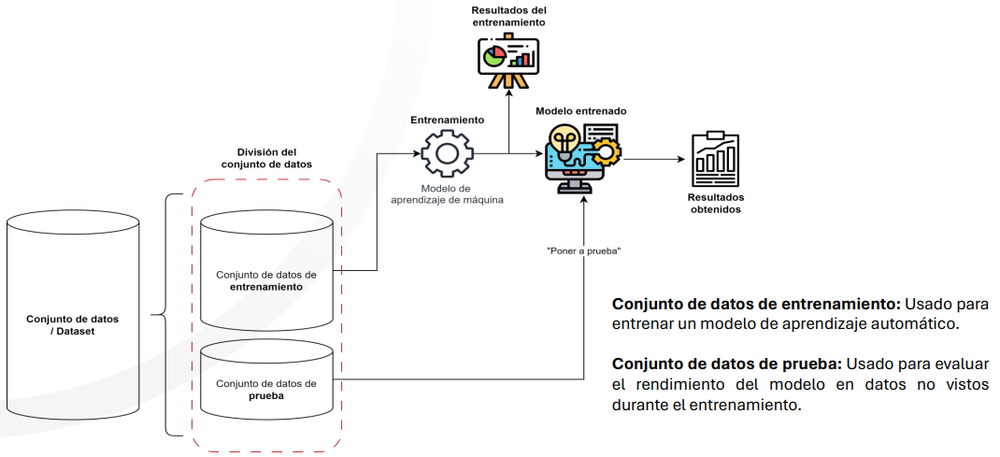
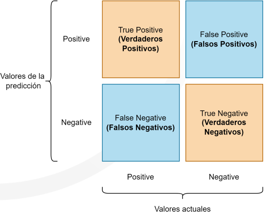
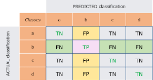
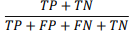

# Metricaz de evaluacion 
>
Estamos haciendo un entrenamiento de un modelo, ya puede ser de clasificacion o regresion, se entrena el modelo, pero no sabemos mas a fondo de como esta funcionando bien el modelo, por lo que tenemos unas metricas las cuales nos ayudan a determinar en que se puede mejorar.
>
La estrutura basica de un modelo es el siguiente:
>

>
Primero se tiene un conjunto de datos que es del cual se va a trabajar, por lo que se divide en 2 datasets diferentes o en algunos casos se puede llegar a dividir hasta en 3, si la persona lo desea.
>
Se divide en datos de entrenamiento y de prueba, ya que con los de entrenamiento como su nombre lo dice seran usados para poder realizar este entrenamiento con toda la estructura del modelo el cual vamos a usar, y lolos de prueba se conectan al final con ese modelo entrenado para ver como se esta comportando con datos nuevos, y con esto verificar si el modelo esta comportandose bien o si hay un problema en el momento de entrenamiento.
>
## Matriz de confusion 
La funcion principal de la matriz de confunsion se realiciona a proyectos los cuales se este haciendo una clasificacion, ya que esta nos ayuda a poder entender como se esta comportando los datos, como se estan clasificando con respecto a los datos reales y con este entender si el modelo relamente esta clasificando de una manera ideal o si se presenta un sesgo en este.
>

>
En la matriz de confusion tenemos 2 partes importantes la parte que seria de los valores los cuales se estan prediciendo frente a los valores actuales del modelo.
>
Esta se divide en 4, tenemos los Falsos Positivos, Falsos Negativos, Verdaderos Positivos, Verdaderos Negativos.
<ul>
<li>Falso Positivo: Es aquel valor donde el valor actual era negativo pero lo predijo como si fuera positivo</li>
<li>Falso Negativo: Donde el valor era positivo pero lo predijo como si fuera negativo</li>
<li>Verdadero Positivo: Es aquel donde predijo que era positivo</li>
<li>Verdadero Negativo: Es aquel donde predijo que era negativo</li>
</ul>

>

>
En la Imagen anterior tenemos un ejemplo de lo que seria de una matriz multiclase, ya que es la que normalmente ocurre cuando se entrena un modelo, en este caso no vamos a enfocar que nuestro verdadero positivo es el b, el valor de falso positivo viene siendo todos los que en la prediccion los clasifico como si fuera b pero en el valor actual se equivoco, y los falsos negativos donde el valor real era el b pero lo clasifico en otra clase.

### Indicadores de la matriz de confusion
Con la matriz de confusion tenemos los valores pero si queremos conocer mas a fondo de mas detalles se usan estos indicadores que permiten determinar si un modelo es correcto o no.

#### Accuracy
La exactitud es lo que define la frecuencia con la que el modelo predice el resultado correcto, y se usa la siguiente formula para el calculo:
>

>
#### Precision
Es un indicador del desempeño del modelo y ayuda a medir la capacidad
>

>