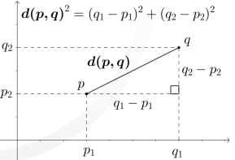

# KNN 
Es un tipo de algoritmo vago, por que no tiene una metrica puntual de optimizacion, hay con las que se puedan hacer la comparacion, nace los modelos parametricos y no parametricos, Parametrico se estiman los parametros a partir de un dataset de entrenamiento para aprender una funcion que pueda clasificar nuevos puntos de datos sin necesidad del dataset original, No parametrico no se pueden caracterizar por un conjunto fijo de parametros crece con el dataset de entrenamiento.
>
k-Nearest Neighbors
El algoritmo cuenta con 3 pasos:
- Es una algoritmo de busqueda en base de una metrica, y esta metrica es una de distancia,
- Encuentra los k-vecinos mas cercanos a la muestra que se requiere clasificar
- Asigna la etiqueta de la clase por la mayoria de votos
>
El numero de k se trata de que sea un valor impar para poder de que el algoritmo pueda tener siempre que uno sea el mayor cuando se busquen los valores cercanos
## Medidas de distancia 

### Distancia Euclideana
Se basa en el teorema de Pitagoras, y encuentra la distancia en linea recta entre 2 puntos.
>

>

### Distancia Manhattan
Se considera que es la suma de los catetos, 

### Similitud del coseno
Es un metodo para cuantificar la similitud o proximidad entre dos vectores. La similitud del coseno mide la cantidad de vectors que apuntan
Es una medida de similaridad entre vectores, es decir, cuanto mas grande sea el cociente entre dos vectores, mas similes son estos.

### Coeficiente de jaccard

### Ecuacion de Minkowski
