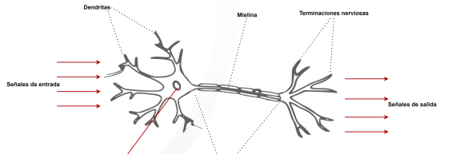
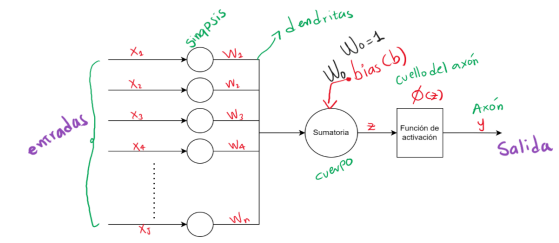
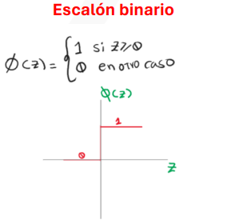
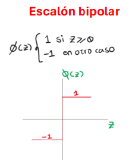
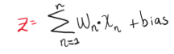
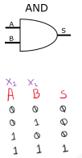

Flujo de trabajo en un proyecto de inteligencia artificial:
<ol>
<li>Preprocesamiento</li>
    <ul>
    <li>Analisis exploratorio de los datos</li>
    </ul>
<li>Entrenamiento Aprendizaje</li>
    <ul>
    <li>modelo de la maquina</li>
    </ul>
</ol>

# Perceptron 

El ser humano siempre ha tratado de replicar el funcionamiento de las neuronas en los seres humanos, la base fundamental esta en entender como funciona la celula llamada neurona. 

Cada neurona cuenta con el nucleo celular, despues una dentritas, las cuales tienen un flujo con informacion de otras neuronas, y todo esto es para que suceda la exitacion, para que esa informacion entre a la celula, dependiendo de si se supera los umbrales de excitacion, y salgan por los terminales nerviosos, los cuales pueden unirse a mas neuronas y asi crear un bucle lleno de muchas neuronas. 

Por cada dentrita o canal de entrada, se recepciona una caracteristica de informacion, y viendo el x, se tendria un valor de x*n dependiendo de la cantidades que maneje el dataset.
Todo esto se ve afectado por un W, el cual es un peso sipnatico, es el peso que tiene cada canal de entrada y que dara cada ponderacion a cada entrada, cada uno es distinto, y se tiene los mismo dependiendo de las caracteristicas de entrada, por lo que desde ahi se puede ponderar cuales tienen mas peso que otras.

Una vez llega al cuerpo de la neurona, donde ocurre una sumatoria, la cual se consolida de la siguiente manera

Z = W1*1+W2*X2+WN*XN + bias

Despues pasa por una funcion de activacion y se le denomina phi

y = phi*z

En el perceptron solo existen solo 2 funciones de activacion:
    -Escalon Unipolar: todo numero mayor que  se convierte en 1
    
     
    -Escalon Bipolar: Numero mayor a 0 es 1, y menor es -1
    

Dependiendo de la funcion de activacion que se usa, se debe de acomodar el perceptron para poder asegurar de que este ideal, y evitar que se generer errores en el momento de ocnvergencia

**Compuerta AND**

Se tienen 2 caracteristicas de entrada X1 y X2, lo cual hace que tengamos la tabla de la verdad anteriormente mostrada, la salida de la AND funciona de esta manera, y es que para que se active ambas entradas deben estar en 1 de resto deben estar de 0.

Tenemos 4 muestras y ademas tenemos dos clases de salida, la 1 y la 0